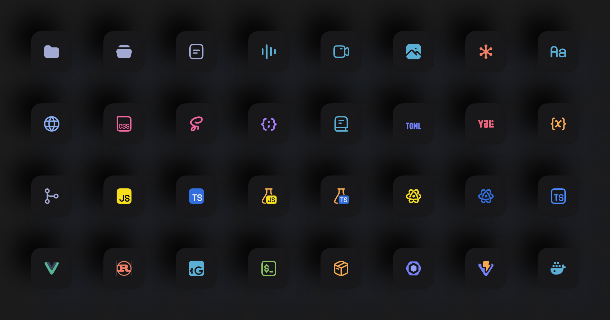

<h1 align="center">Kardia File Icon Theme for VS Code.</h1>

## ❤️ Gratitude

- [Hypernym Icons](https://github.com/hypernym-studio/vscode-icons)
- [Charmed Icons](https://github.com/littensy/charmed-icons)

